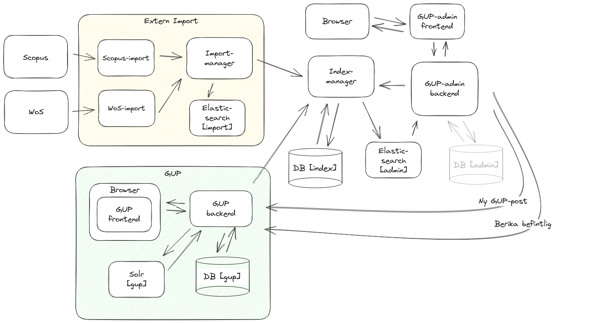

# gup-admin

## index all stuff

cd docker
./index.sh

## index GUP Posts

docker-compose exec gup-backend bash -c 'bundle exec rake gup_admin:index_all LIMIT=1000 OFFSET=0'

## index WoS Posts

docker-compose exec gup-imports bash -c 'python3 /data/scripts/put-scopus-docs.py -d /data/files/scopus-normalised/testdata -u $GUP_ADMIN_BASE_URL -a $GUP_ADMIN_API_KEY'

##

## index departments

docker-compose exec index-manager-backend mix run -e "GupIndexManager.Resource.Departments.initialize |> IO.inspect()"

## TODO

## FRONTEND

- USING NUXT 3
- CD nuxt-frontend
- yarn install
- yarn dev
- yarn run build (to test build outside docker)

## BACKEND

- mix deps.get ---> install dependecies
- iex -S mix phx.server ----> start dev server

### FRONTEND DOCKER

- CD docker/build
- ./build.sh
- cd ..
- ./docker-compose-release.sh up

### DOCKER LAB

### DISKUTERA

- 404 sidor (utseende)
- Nivå på felhantering (vet inte exakt vad jag menar)
- Namn på olika parametrar i filter på queryparam?
- Verikal skroll på filtrerade poster eller inte? höjd?
